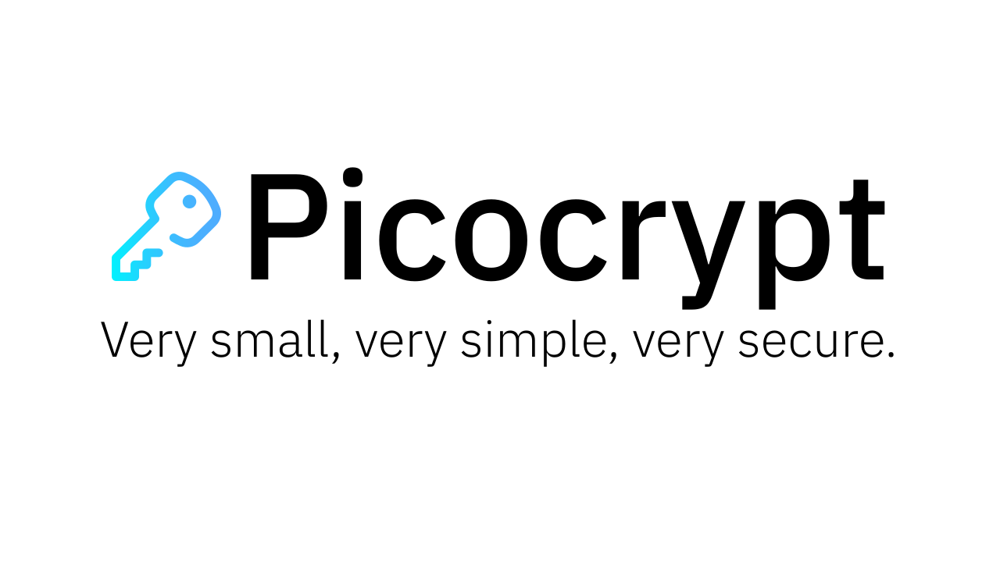

Picocrypt is a <i>very small</i> (hence "Pico"), very simple, yet very secure file encryption tool. It uses the modern ChaCha20-Poly1305 cipher suite as well as Argon2, making it about as secure and modern of an encryption tool as you'll ever get your hands on. It's very simple to use, which allows anyone to start encrypting private files, no matter what level of experience they have with computers. Picocrypt's focus is <i>security</i>, so it might be slightly slower and less attractive visually than others. Remember: your privacy and security is in your hands. Take good care of it and encrypt your files with Picocrypt. <strong>Please <a href="Donate.md">donate</a> to help raise money to get Picocrypt audited.</strong>

# Downloads
<strong>Windows</strong>

Picocrypt for Windows is as easy as it gets. To download the latest, standalone, and portable executable, click <u><strong><a href="https://github.com/HACKERALERT/Picocrypt/releases/download/1.11/Picocrypt.exe" target="_blank">here</a></u></strong>. You can also download a specific release from the Releases tab.

<strong>MacOS</strong>

Picocrypt for MacOS is also very easy to use. Download the latest, standalone, and portable executable for MacOS <u><strong><a href="https://github.com/HACKERALERT/Picocrypt/releases/download/1.11/Picocrypt.app.zip" target="_blank">here</a></u></strong>. Older releases are available under Releases. MacOS might show a notice that Picocrypt is malware (it isn't) and disable opening it. To fix this, open Finder, Ctrl and right click on Picocrypt, and hit "Open". You might have to do this two times to open Picocrypt. After opening Picocrypt, be patient while Picocrypt loads. It might take a couple seconds.

<strong>Linux (Debian-based)</strong>

Picocrypt for Debian-based Linux distros is coming soon.

 
Note: For some reason, there's an outdated and useless piece of abandonware called PicoCrypt on the Internet, which was last updated in 2005. PicoCrypt is not related to Picocrypt (this project). <strong>Make sure you only download Picocrypt from this Github repository to ensure that you download the correct and backdoor-free software. Downloading from somewhere else could mean that you're potentially downloading malicious or hacked software!</strong>

# Why Picocrypt?
Why should you use Picocrypt, instead of Bitlocker, NordLocker, VeraCrypt, or 7-Zip? Here are some reasons why you should switch to Picocrypt:

<ul>
	<li>The only safe encryption is the one you do yourself. Don't trust cloud providers to "encrypt" your data, because you'll never know if they do it or not. Picocrypt is meant to be the simplest tool to allow you to take control over your confidential data and protect it with the most secure and modern standards available.</li>
	<li>Unlike NordLocker, Bitlocker, and most cloud storage providers, Picocrypt and its dependencies are FOSS (free open-source software) and can be audited. You can verify for yourself that there aren't any backdoors or flaws.</li>
	<li>Picocrypt is portable and <i>tiny</i> (just 3MB for Windows!). It's much lighter than NordLocker (>100MB) and VeraCrypt (>30MB). The standalone executables can run on any machine (Windows, MacOS, or Linux) and they run with no installation, dependencies, or admin privileges. Picocrypt floats your boat without any bloat.</li>
	<li>It's infinitely easier to use than VeraCrypt (no need to create volumes) and a 5-year-old could probably use Picocrypt. All you need to do is select your file(s) and enter a password. The internals such as encryption, authentication, and anti-corruption are completely handled by Picocrypt, so you don't have to worry about a thing.</li>
	<li>Picocrypt is built for security, using modern standards and secure settings. It's carefully designed and uses well-known libraries to do cryptography. See <strong>Security</strong> below for more info.</li>
	<li>It supports file integrity checking through Poly1305, which means that you would know if a hacker has maliciously modified your data. This is useful for transfering sensitive data where authenticity is crucial.</li>
	<li>Picocrypt supports anti-corruption through Reed-Solomon. Unlike other encryption tools, Picocrypt actively protects your files by adding extra Reed-Solomon bytes, so if your file gets corrupted (ie. hard drive failure), Picocrypt can still fix the errors and decrypt your files. None of Bitlocker, NordLocker, VeraCrypt, or 7-Zip has this ability.</li>
</ul>

# Instructions
Picocrypt is about as simple as it gets. Just drag and drop the file(s) and folder(s) you choose, enter a password, and start. There are some additional options that you can use for more control:

<ul>
	<li>File metadata (editable for encryption, readonly for decryption): Use this to store notes, information, and text along with the file (it won't be encrypted). For example, you can put a description of the file before sending it to someone. When the person you sent it to selects the file in Picocrypt, your description will be shown to that person.</li>
	<li>Keep decrypted output even if it's corrupted or modified (decryption only): Picocrypt automatically checks for integrity upon decryption. If the file has been modified or is corrupted, Picocrypt will delete the output. If you want to keep the corrupted or modified data after decryption, check this option. Also, if this option is checked and the Reed-Solomon feature was used on the encrypted file, Picocrypt will attempt to recover as much of the file as possible during decryption, if it is corrupted.</li>
	<li>Securely erase and delete original file (encryption only): If checked, Picocrypt will use system internals to overwrite the input file(s) multiple times and delete it. This method is better than just deleting the original file, because in that case, the original file can still be recovered by hackers using special software. Picocrypt securely deletes the original file making sure that it's impossibe to retrieve the original file after deletion.</li>
	<li>Prevent corruption using Reed-Solomon (encryption only): This feature is very useful if you are planning on archiving important data on a cloud provider or external hard drive for a long time. If checked, Picocrypt will use the Reed-Solomon error correction code to add 13 extra bytes for every 128 bytes to prevent file corruption. This means that up to ~5% (13/128/2) of your file can corrupt, and Picocrypt will still be able to correct it and decrypt your files with no corruption. Obviously, if your file corrupts very badly (ie. you dropped your hard drive), Picocrypt won't be able to fully recover your files, but it will try its best to recover what it can. Note that decryption is very slow because Picocrypt is reassembling and (if necessary) correcting broken bytes. The output will also be ~10% larger.</li>
</ul>

# Security
I have a solid understanding of cryptography, so I can say with very high confidence that Picocrypt is very secure. It uses XChaCha20-Poly1305, which is a revision of the eSTREAM winner, Salsa20. ChaCha20 has been through a significant amount of cryptanalysis and was selected by security engineers at Google to be used in modern TLS suites. It's considered to be the modern suite of symmetric encryption, and makes Picocrypt more secure than Bitlocker, NordLocker, and 7-Zip. It's used by Cloudflare, Google, and many other forward-thinking companies.

In terms of practical security, I have 2FA enabled on all accounts with a tie to Picocrypt, so you can rest assured that the official Picocrypt repository won't be hacked.

For key derivation, Picocrypt uses Argon2d, winner of the PHC (Password Hashing Competition), which was completed in 2015. Argon2 is even slower than Scrypt and Bcrypt (for those that don't understand crypto, this is a good thing), making GPU, ASIC, and FPGA attacks impractical due to the huge amount of RAM that is used and written to during the key derivation.

For key checking, SHA3-512 (Keccak) is used. For corruption checking, BLAKE3 is used. Before decrypting, Picocrypt checks whether the password is correct by comparing <i>the derived key</i> to a SHA3-512 hash stored in the encrypted file. SHA3 is the latest standard for hashing recommended by the NIST. It's a modern and well-designed hash function that's open-source, unpatented, and royalty-free.

XChaCha20-Poly1305, Argon2, and SHA3 are all well-recognized within the field of cryptography and are all considered to be mature and future-proof. You can rely on these ciphers and algorithms to protect your data, as they are all modern and have undergone a large amount of cryptanalysis.

I did not write the crypto for Picocrypt. Picocrypt uses two Python libraries, <code>argon2-cffi</code> and <code>pycryptodome</code> to do the heavy lifting, both of which are well known and popular within the Python community. For people who want to know how Picocrypt handles the crypto, or for the paranoid, here is a breakdown of how Picocrypt protects your data:

<ol>
	<li>A 16-byte salt (for Argon2d) and a 24-byte nonce (for XChaCha20) is generated using a CSPRNG (Python's <code>os.urandom()</code>)</li>
	<li>
		The encryption/decryption key is generated through Argon2d using the salt above and the following parameters:
		<ul>
			<li>Time cost: 8</li>
			<li>Memory cost: 2^30 (1GiB)</li>
			<li>Parallelism: 8</li>
		</ul>
	</li>
	<li>If decrypting, compare the derived key with the SHA3-512 hash of the correct key stored in the ciphertext. If encrypting, compute the SHA3-512 of the derived key and add to ciphertext.</li>
	<li>Encryption/decryption start, reading in 1MB chunks at a time. For each chunk, it is first encrypted by XChaCha20, and then a BLAKE3 CRC is updated.</li>
	<li>If anti-corruption is checked, the 1MB chunk will be split into 128 byte chunks and 13 additional Reed-Solomon (parity) bytes will be added. If decrypting, decode the encoded 1MB chunk to get the raw data.</li>
	<li>When encryption/decryption is finished, the MAC tag (Poly1305) will be added to the ciphertext or verified, depending on if you're encrypting or decrypting. If 'Secure wipe' is enabled, the original file is securely deleted via system internals (<code>sdelete64</code> for Windows, <code>rm -P</code> for MacOS, and <code>shred</code> on Linux).</li>
	<li>Similar to above, the BLAKE3 CRC is either checked or added to the ciphertext depending on the operation.</li>
	<li>If decrypting and both the BLAKE3 CRC and Poly1305 tag are correct, decryption is considered successful and the process is done. If either don't match, decryption is unsuccessful and an error message will be displayed.</li>
</ol>

Note: the list above is simplified. A lot more is actually happening.

# Roadmap
See <code>Roadmap.md</code> for a list of new features and improvements that I'm working on.

# Community
Here's some places where you can see the latest news about Picocrypt and get involved:
<ul>
	<li><a href="https://www.reddit.com/r/Picocrypt/">Reddit</a></li>
	<li><a href="">Discord (coming soon)</a></li>
	<li><a href="https://twitter.com/picocrypt">Twitter</a></li>
</ul>
These are the official Picocrypt social groups and accounts. Be aware of scammers and hackers that might try to impersonate me and get you to download malicious software. Only trust these accounts and only download from this Github repo.

# Limitations

<ul>
	<li>Max file size of a single file is 256GB, due to ChaCha20 cipher itself. This is because the counter for ChaCha20 will overflow out of the 32-bit range at 256GB. You can split files into chunks for files larger than 256GB.</li>
	<li>Argon2 may take a while to derive a key, but realize that this is all for security. Security and speed were never friends and there is always a trade-off between security and speed.</li>
	<li>The portable executables can be detected as viruses. I've done my best and submitted them as false positives to a couple antivirus companies to deal with this. If your antivirus is detecting Picocrypt as a virus, please help the community and submit it as a false positive to your antivirus provider.</li>
</ul>

# Contribution
If you find a bug or security issue, please create an Issue. If the security problem is severe or critical and could potentially be exploited by hackers if published, please contact me privately <a href="https://evansu.cc/#contacts">here</a>. If one of Picocrypt's dependencies gets a critical security patch, let me know and I'll update the code (if necessary). I'm also open to suggestions and features (you can leave an Issue or write about it in Discussions).

# Donations
If you find Picocrypt useful, please consider donating. I've spent countless hours on Picocrypt and I'd love to get Picocrypt along with its dependencies audited by a cybersecurity firm such as Cure53. Audits typically cost <i>thousands</i> of dollars, so I'm asking for your support. If every person who saw this message or uses Picocrypt donated a dollar or two, I'd have enough funds to get Picocrypt audited. For more information about donating, see <a href="Donate.md">here</a>.

# Thank You's
A <i>huge</i> thanks to the following list of people, who were the first people to donate and support Picocrypt:
<ul>
	<li>W.Graham</li>
	<li>N. Chin</li>
</ul>

Also, thanks to Freepik from Flaticon for Picocrypt's key icon.
